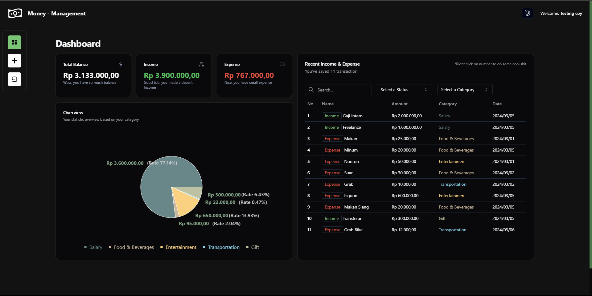

## A Management App
Help you save your money by storing your history of transaction!

## Tech Stack
Here are the technologies and libraries used in this project:

1. Next JS: A React framework for building server-side rendered and static websites.
2. TypeScript: A statically typed superset of JavaScript that compiles to plain JavaScript.
3. Tailwind CSS + TWMerge(clsx): A utility-first CSS framework for rapidly building custom user interfaces.
4. Shadcn UI: A UI component library for Next.js applications.
5. Framer Motion: A production-ready motion library for React.
6. Sonner Toast: A lightweight and customizable toast notification library.
7. Appwrite BaaS: A backend-as-a-service platform that provides various features like authentication, database, and storage.

Feel free to explore the documentation of each technology to learn more about their features and how they were used in this project.

## Getting Started
1. Register your account
2. Login with your recently created account
3. Click + to add transaction
4. Fill the form & submit
5. Hover the name for description
6. Right click on the number to do edit or delete

## Dashboard

